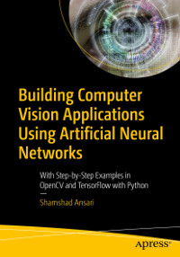

# Apress Source Code

This repository accompanies [*Building Computer Vision Applications Using Artificial Neural Networks*](https://www.apress.com/9781484258866) by Shamshad Ansari (Apress, 2020).

[comment]: #cover

Download the files as a zip using the green button, or clone the repository to your machine using Git.

## Releases

Release v1.0 corresponds to the code in the published book, without corrections or updates.

## Contributions

See the file Contributing.md for more information on how you can contribute to this repository.

# Book Value Proposition:
- Contains real examples that you can implement and modify to build useful computer vision systems
- Gives line-by-line explanations of computer vision working code examples  
- Explains training neural networks involving large numbers of images on cloud infrastructure, such as Amazon AWS, Google Cloud Platform, and Microsoft Azure 

# About the Book:
Apply computer vision and machine learning concepts in developing business and industrial applications ​using a practical, step-by-step approach. 

The book comprises four main sections starting with setting up your programming environment and configuring your computer with all the prerequisites to run the code examples. Section 1 covers the basics of image and video processing with code examples of how to manipulate and extract useful information from the images. You will mainly use OpenCV with Python to work with examples in this section. 

Section 2 describes machine learning and neural network concepts as applied to computer vision. You will learn different algorithms of the neural network, such as convolutional neural network (CNN), region-based convolutional neural network (R-CNN), and YOLO. In this section, you will also learn how to train, tune, and manage neural networks for computer vision. Section 3 provides step-by-step examples of developing business and industrial applications, such as facial recognition in video surveillance and surface defect detection in manufacturing. 

The final section is about training neural networks involving a large number of images on cloud infrastructure, such as Amazon AWS, Google Cloud Platform, and Microsoft Azure. It walks you through the process of training distributed neural networks for computer vision on GPU-based cloud infrastructure. By the time you finish reading Building Computer Vision Applications Using Artificial Neural Networks and working through the code examples, you will have developed some real-world use cases of computer vision with deep learning. 

## What You Will Learn

·         Employ image processing, manipulation, and feature extraction techniques

·         Work with various deep learning algorithms for computer vision
·         Train, manage, and tune hyperparameters of CNNs and object detection models, such as R-CNN, SSD, and YOLO

·         Build neural network models using Keras and TensorFlow

·         Discover best practices when implementing computer vision applications in business and industry

·         Train distributed models on GPU-based cloud infrastructure 
## Who This Book Is For 

Data scientists, analysts, and machine learning and software engineering professionals with Python programming knowledge.

## About the Author:
Shamshad (Sam) Ansari is a distinguished data scientist, inventor and author. He has several technology publishing in his name. He has co-authored 4 US Patents related to AI in healthcare.

Sam is the founder, president and CEO of Accure, an AI automation company. He enjoys working with software engineers, data scientists, devops, and business analysts, and solving real-world scientific and business problems.

He has worked with 4 tech startups in his 20+ years of career. Prior to starting Accure, he worked for Apixio, a healthcare AI startup, IBM, and Orbit Solutions.

He has technical expertise in the area of computer vision, machine learning, AI, cognitive science, NLP, and big data. He architected, designed, and developed an AI automation platform, called Momentum, that allows to build AI solutions without writing code.

He is passionate about teaching and mentoring. He has spent more than 10,000 hours in teaching and mentoring students from across the world.

Sam holds a Bachelor's degree in engineering from BIT Sindri and Master's degree in computer science from Indian Institute of Information Technology and Management (IIITM) Kerala.
